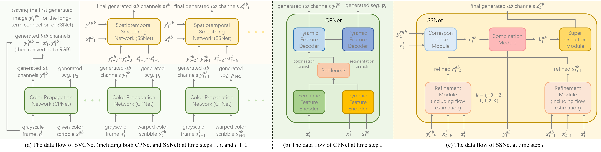

# SVCNet

supplementary material for paper "SVCNet: Real-time Scribble-based Video Colorization with Pyramid Networks", under review of IEEE Transactions on Image Processing.

SVCNet is an architecture for scribble-based video colorization, which includes two sub-networks: CPNet and SSNet.



## 1 Preparation

## 1.1 Environment

We test the code on CUDA 10.0, where the basic requirements are as follows:

- pytorch==1.2.0
- torchvision==0.4.0
- cupy-cuda100
- python-opencv
- scipy
- scikit-image

If you use **conda**, the following command is helpful:
```bash
conda env create -f environment.yaml
conda activate svcnet
```

### 1.2 Pre-trained models

We upload the pre-trained SVCNet modules (including CPNet and SSNet) and other public pre-trained models (including PWCNet and VGG-16). By default we put all those files under a **trained_models** root.

All the pre-trained model files: [download link](https://portland-my.sharepoint.com/:f:/g/personal/yzzhao2-c_my_cityu_edu_hk/EoAhNnlzoe1LkoI0CSlw9q8B-zOmJlhZUoxBVC3m3eiDUQ?e=WeTQHQ)

Alternatively, you can download following files if you only want to do inference:

- [final CPNet](https://portland-my.sharepoint.com/:u:/g/personal/yzzhao2-c_my_cityu_edu_hk/EXUIeeSbnqVJq7s4PU2emwABWfxLP1UKDHajSv9lGVH_3Q?e=q4aa8g)

- [final SSNet](https://portland-my.sharepoint.com/:u:/g/personal/yzzhao2-c_my_cityu_edu_hk/EaE2q8nnMv5Hv6qDJduc6_EB6VNe5DGwavHICUwwwlqS_A?e=V4zKII)

- [PWCNet (for optical flow computation)](https://portland-my.sharepoint.com/:u:/g/personal/yzzhao2-c_my_cityu_edu_hk/Eefwdef8l99LkqCiajPjwxcBN7tTcQCPSwZYl4zKZK7N9w?e=p05AUW)

### 1.3 Dataset

We use [ImageNet](https://image-net.org/index.php), [DAVIS](https://davischallenge.org/), and [Videvo](https://github.com/phoenix104104/fast_blind_video_consistency) datasets as our training set. Please cite the original papers if you use these datasets. We release `zip` files that contain those images. By default we put all those files under a **data** root.

#### 1.3.1 Training set of ImageNet (256x256 resolution, 1281167 files)

All the ImageNet files: [download link](https://portland-my.sharepoint.com/:f:/g/personal/yzzhao2-c_my_cityu_edu_hk/EleptIBNdqRNt7lQddcZqSkBhwtypjpgvdEnO4f1tqvF8A?e=md7hxL)

- [image files, JPG format](https://portland-my.sharepoint.com/:u:/g/personal/yzzhao2-c_my_cityu_edu_hk/ERbTQ-SsaJJIrF975FHkX8IBsHRQhFucCaMxnW0cxUZzJg?e=M1j6eo)

- [saliency map files](https://portland-my.sharepoint.com/:u:/g/personal/yzzhao2-c_my_cityu_edu_hk/EcYyMwjOkrZOuG-JX6hmdrQBzvnn4s_PwLwqdyrVg701sQ?e=RIOu3s)

#### 1.3.2 Validation set of ImageNet (256x256 resolution, 50000 files)

- [image files, JPG format](https://portland-my.sharepoint.com/:u:/g/personal/yzzhao2-c_my_cityu_edu_hk/EYOPzwZ0L-5HodA2uDZoUhsB90JhAWIyIYOwCwMSOHON1Q?e=tzbVI1)

- [saliency map files](https://portland-my.sharepoint.com/:u:/g/personal/yzzhao2-c_my_cityu_edu_hk/EZSybNec0IZDtCk1C1Gx3IsBN-Q1oyUkmKk1HfuDr2_f0g?e=MeBx9u)

#### 1.3.3 Training set of DAVIS-Videvo dataset (156 video clips)

All the DAVIS-Videvo files: [download link](https://portland-my.sharepoint.com/:f:/g/personal/yzzhao2-c_my_cityu_edu_hk/El0hCFaqaaRHoNkrqtedQdcBOXzQ7HFySRhCwDx3ZK9_nw?e=DKCBjA)

- [image files, JPG format](https://portland-my.sharepoint.com/:u:/g/personal/yzzhao2-c_my_cityu_edu_hk/EYorh60RjVBEqnSJ_7tdBVMB6_Glq3b2vNk-UBXf9LpBTQ?e=Wwsgmy)

- [image files, lmdb format](https://portland-my.sharepoint.com/:u:/g/personal/yzzhao2-c_my_cityu_edu_hk/Ed0C2MlTsBdGov_bcszB-DsBpHRyZ1ZS_ApvhRkk1sbRQw?e=1yo0TD)

- [segmentation and saliency map files](https://portland-my.sharepoint.com/:u:/g/personal/yzzhao2-c_my_cityu_edu_hk/EYmmiepd6ghGosqZZ8hGKA4BA_Ta2WaHPUpq_LHFmfsk2g?e=SGPrHD)

#### 1.3.4 Validation set of DAVIS-Videvo dataset (50 video clips)

- [image files, JPG format](https://portland-my.sharepoint.com/:f:/g/personal/yzzhao2-c_my_cityu_edu_hk/Et6UKrHu8rxBn3xf_AY2gGoBgh-F0dZXh4KDs7wrQwHsmw?e=bnbCi4)

- [original files of DAVIS dataset, including images and segmentations](https://portland-my.sharepoint.com/:u:/g/personal/yzzhao2-c_my_cityu_edu_hk/Ebc3Yruy0dhDifQAojTK5wwBh-v7LrTHtwhj_r20MoHC6Q?e=cBXa2h)

We generate saliency maps for images in the ImageNet dataset. Note that, images in the DAVIS dataset has segmentation labels, while we generate saliency maps for images in the Videvo dataset. The saliency detection method is [Pyramid Feature Attention Network for Saliency detection](https://openaccess.thecvf.com/content_CVPR_2019/papers/Zhao_Pyramid_Feature_Attention_Network_for_Saliency_Detection_CVPR_2019_paper.pdf).

## 2 Arrangement

- **CPNet**: includes scripts and codes for training and validating CPNet

- **SSNet**: includes scripts and codes for training SSNet and validating SVCNet

- **Evaluation**: includes codes for evaluation (e.g., Tables II, IV, and V in the paper)

- **GCS**: includes codes for generating validation color scribbles

## 3 Fast inference

We include a legacy video segment along with color scribble frames with 4 different styles. The input grayscale frames and color scribbles are also included.

Users can easily reproduce the following results by running:

```bash
cd SSNet
python test.py
```


## 4 Visualization

A few video samples on the validation dataset are illustrated below:


## 5 Acknowledgement

Some codes are borrowed from the [PyTorch-PFAN](https://github.com/sairajk/PyTorch-Pyramid-Feature-Attention-Network-for-Saliency-Detection), [SCGAN](https://github.com/zhaoyuzhi/Semantic-Colorization-GAN), [VCGAN](https://github.com/zhaoyuzhi/VCGAN), [PyTorch-PWC](https://github.com/sniklaus/pytorch-pwc), and [DEVC](https://github.com/zhangmozhe/Deep-Exemplar-based-Video-Colorization) projects. Thanks for their awesome works.

## 6 Citation

If you think this work is helpful, please consider cite:
