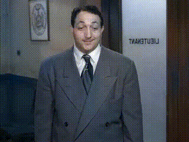

# SVCNet

<br>Official PyTorch Implementation of the SVCNet Paper<br>

[Project](https://github.com/zhaoyuzhi/SVCNet) | [arXiv](https://arxiv.org/abs/2303.11591)

## 1 Introduction

SVCNet is an architecture for scribble-based video colorization, which includes two sub-networks: CPNet and SSNet. This repo contains training and evaluation code for the following paper:

> [**SVCNet: Scribble-based Video Colorization Network with Temporal Aggregation**](https://github.com/zhaoyuzhi/SVCNet)<br>
> Yuzhi Zhao<sup>1</sup>, Lai-Man Po<sup>1</sup>, Kangcheng Liu<sup>2</sup>, Xuehui Wang<sup>3</sup>, Wing-Yin Yu<sup>1</sup>, Pengfei Xian<sup>1</sup>, Yujia Zhang<sup>4</sup>, Mengyang Liu<sup>4</sup><br>
> <sup>1</sup>City University of Hong Kong, <sup>2</sup>Nanyang Technological University, <sup>3</sup>Shanghai Jiao Tong University, <sup>4</sup>Tencent Video<br>
> *IEEE Transactions on Image Processing (**TIP**), 2023*<br>


## 2 Preparation

### 2.1 Environment

We test the code on CUDA 10.0 (higher version is also compatible). The basic requirements are as follows:

- pytorch==1.2.0
- torchvision==0.4.0
- cupy-cuda100
- python-opencv
- scipy
- scikit-image

If you use **conda**, the following command is helpful:
```bash
conda env create -f environment.yaml
conda activate svcnet
```

### 2.2 Pre-trained models

We upload the pre-trained SVCNet modules (including CPNet and SSNet) and other public pre-trained models (including PWCNet and VGG-16). By default we put all those files under a **trained_models** root.

All the pre-trained model files can be downloaded at this [link](https://portland-my.sharepoint.com/:f:/g/personal/yzzhao2-c_my_cityu_edu_hk/EoAhNnlzoe1LkoI0CSlw9q8B-zOmJlhZUoxBVC3m3eiDUQ?e=WeTQHQ).

Alternatively, you can download following files if you only want to do inference:

- [final CPNet](https://portland-my.sharepoint.com/:u:/g/personal/yzzhao2-c_my_cityu_edu_hk/EXUIeeSbnqVJq7s4PU2emwABWfxLP1UKDHajSv9lGVH_3Q?e=q4aa8g)

- [final SSNet](https://portland-my.sharepoint.com/:u:/g/personal/yzzhao2-c_my_cityu_edu_hk/EaE2q8nnMv5Hv6qDJduc6_EB6VNe5DGwavHICUwwwlqS_A?e=V4zKII)

- [PWCNet (for optical flow computation)](https://portland-my.sharepoint.com/:u:/g/personal/yzzhao2-c_my_cityu_edu_hk/Eefwdef8l99LkqCiajPjwxcBN7tTcQCPSwZYl4zKZK7N9w?e=p05AUW)

### 2.3 Dataset

We use [ImageNet](https://image-net.org/index.php), [DAVIS](https://davischallenge.org/), and [Videvo](https://github.com/phoenix104104/fast_blind_video_consistency) datasets as our training set. Please cite the original papers if you use these datasets. We release **zip** files that contain those images. By default we put all those files under a **data** root.

We generate saliency maps as pseudo segmentation labels for images in the ImageNet and Videvo datasets. Note that, images in the DAVIS dataset have segmentation labels. The saliency detection method is [Pyramid Feature Attention Network for Saliency detection](https://openaccess.thecvf.com/content_CVPR_2019/papers/Zhao_Pyramid_Feature_Attention_Network_for_Saliency_Detection_CVPR_2019_paper.pdf). The generated saliency maps are also released.

All the ImageNet files can be downloaded at this [link](https://portland-my.sharepoint.com/:f:/g/personal/yzzhao2-c_my_cityu_edu_hk/EleptIBNdqRNt7lQddcZqSkBhwtypjpgvdEnO4f1tqvF8A?e=md7hxL). All the DAVIS-Videvo files can be downloaded at this [link](https://portland-my.sharepoint.com/:f:/g/personal/yzzhao2-c_my_cityu_edu_hk/El0hCFaqaaRHoNkrqtedQdcBOXzQ7HFySRhCwDx3ZK9_nw?e=DKCBjA). Alternatively, you can find each seperate file below:

#### 2.3.1 Training set of ImageNet (256x256 resolution, 1281167 files)

- [image files, JPG format](https://portland-my.sharepoint.com/:u:/g/personal/yzzhao2-c_my_cityu_edu_hk/ERbTQ-SsaJJIrF975FHkX8IBsHRQhFucCaMxnW0cxUZzJg?e=M1j6eo)

- [saliency map files](https://portland-my.sharepoint.com/:u:/g/personal/yzzhao2-c_my_cityu_edu_hk/EcYyMwjOkrZOuG-JX6hmdrQBzvnn4s_PwLwqdyrVg701sQ?e=RIOu3s)

#### 2.3.2 Validation set of ImageNet (256x256 resolution, 50000 files)

- [image files, JPG format](https://portland-my.sharepoint.com/:u:/g/personal/yzzhao2-c_my_cityu_edu_hk/EYOPzwZ0L-5HodA2uDZoUhsB90JhAWIyIYOwCwMSOHON1Q?e=tzbVI1)

- [saliency map files](https://portland-my.sharepoint.com/:u:/g/personal/yzzhao2-c_my_cityu_edu_hk/EZSybNec0IZDtCk1C1Gx3IsBN-Q1oyUkmKk1HfuDr2_f0g?e=MeBx9u)

#### 2.3.3 Training set of DAVIS-Videvo dataset (156 video clips)

- [image files, JPG format](https://portland-my.sharepoint.com/:u:/g/personal/yzzhao2-c_my_cityu_edu_hk/EYorh60RjVBEqnSJ_7tdBVMB6_Glq3b2vNk-UBXf9LpBTQ?e=Wwsgmy)

- [image files, lmdb format](https://portland-my.sharepoint.com/:u:/g/personal/yzzhao2-c_my_cityu_edu_hk/Ed0C2MlTsBdGov_bcszB-DsBpHRyZ1ZS_ApvhRkk1sbRQw?e=1yo0TD)

- [segmentation and saliency map files](https://portland-my.sharepoint.com/:u:/g/personal/yzzhao2-c_my_cityu_edu_hk/EYmmiepd6ghGosqZZ8hGKA4BA_Ta2WaHPUpq_LHFmfsk2g?e=SGPrHD)

#### 2.3.4 Validation set of DAVIS-Videvo dataset (50 video clips)

- [image files, JPG format](https://portland-my.sharepoint.com/:f:/g/personal/yzzhao2-c_my_cityu_edu_hk/Et6UKrHu8rxBn3xf_AY2gGoBgh-F0dZXh4KDs7wrQwHsmw?e=bnbCi4)

- [original files of DAVIS dataset, including images and segmentations](https://portland-my.sharepoint.com/:u:/g/personal/yzzhao2-c_my_cityu_edu_hk/Ebc3Yruy0dhDifQAojTK5wwBh-v7LrTHtwhj_r20MoHC6Q?e=cBXa2h)

## 3 Arrangement

- **CPNet**: includes scripts and codes for training and validating CPNet

- **SSNet**: includes scripts and codes for training SSNet and validating SVCNet

- **Evaluation**: includes codes for evaluation (e.g., Tables II, IV, and V in the paper)

- **GCS**: includes codes for generating validation color scribbles

## 4 Fast inference

### 4.1 Demo

We include a legacy video segment along with their corresponding color scribble frames with 4 different styles. The input grayscale frames and color scribbles are also included. You may find the code related to how to generate these color scribbles in **GCS** sub-folder. Users can easily reproduce the following results by running:

```bash
cd SSNet
python test.py
```




### 4.2 Test on user data

- Creating your own scribbles (see **GCS** sub-folder). You need first provide the first color scribble; then, you can use **generate_color_scribbles_video.py** script to obtain the following scribbles based on the optical flows of your own grayscale video.

- Inference with your generated scribbles (see **SSNet** sub-folder). Please follow the guide in the README file, e.g., running **test.py**.

## 5 Visualization

A few video samples on the validation dataset are illustrated below:


## 6 Acknowledgement

Some codes are borrowed from the [PyTorch-PFAN](https://github.com/sairajk/PyTorch-Pyramid-Feature-Attention-Network-for-Saliency-Detection), [SCGAN](https://github.com/zhaoyuzhi/Semantic-Colorization-GAN), [VCGAN](https://github.com/zhaoyuzhi/VCGAN), [PyTorch-PWC](https://github.com/sniklaus/pytorch-pwc), and [DEVC](https://github.com/zhangmozhe/Deep-Exemplar-based-Video-Colorization) projects. Thanks for their awesome works.

## 7 Citation

If you think this work is helpful, please consider cite:

```bash
@article{zhao2023svcnet,
  title={SVCNet: Scribble-based Video Colorization Network with Temporal Aggregation},
  author={Zhao, Yuzhi and Po, Lai-Man and Liu, Kangcheng and Wang, Xuehui and Yu, Wing-Yin and Xian, Pengfei and Zhang, Yujia and Liu, Mengyang},
  journal={IEEE Transactions on Image Processing (TIP)},
  year={2023}
}
```
